# Architecture Overview
This document serves as a critical, living template designed to equip agents with a rapid and comprehensive 
understanding of the codebase's architecture, enabling efficient navigation and effective contribution from 
day one. Update this document as the codebase evolves.

## System Context Diagram

```mermaid
architecture-beta
    service u(user)[User]
    service fe(internet)[SPA]
    service be(server)[Backend]
    service db(database)[Database]
    service gov(internet)['data.gov.my']

    u:R -- L:fe
    fe:R -- L:be
    be:R -- L:db
    be:T -- B:gov
```

## Core Components

### Frontend

Name: Single Page Application

Description: Main user interface for interacting with the system, allowing user to search bus.

Technologies: Vue.js, shadcn/vue

Deployment:

### Backend

Modular monolith. Below are the core modules.

Technologies: Go

Deployment: 

#### Bus Search

#### Static Data Ingestion

### Data Stores

#### PostgreSQL

Name: Primary database

Type: PostgreSQL

Purpose: GTFS static data, to allow user search public transportation static data.

Key Schemas/Tables:
- agencies
- calendar
- frequencies
- routes
- shapes
- stop_times
- stops
- trips

## External Integrations / APIs

### data.gov.my

Purpose: Get GTFS static data from multiple agencies.

Integration Method: REST API

## Deployment and Infrastructure

Cloud Provider: AWS

Key Services Used: Kubernetes, EC2, RDS, S3, CloudFront

CI/CD Pipeline: Github Actions

Monitoring and Logging: Promethus, Grafana

## Security Consideration

Data Encryption: TLS in transit

