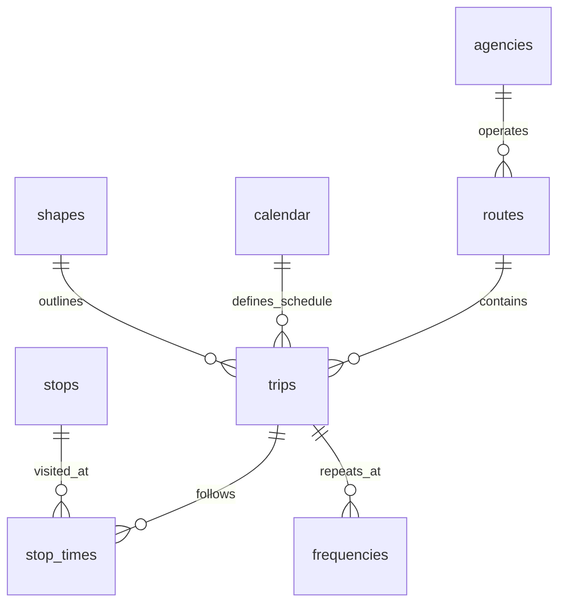
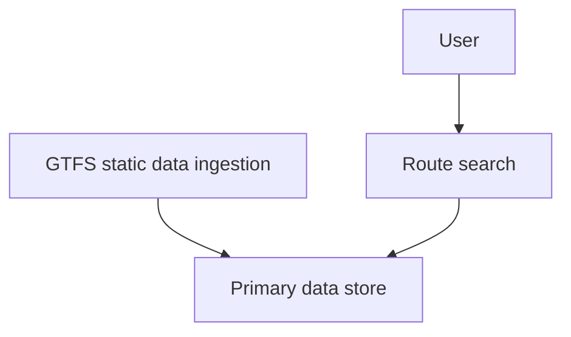

# Architecture Overview
This document serves as a critical, living template designed to equip agents with a rapid and comprehensive 
understanding of the codebase's architecture, enabling efficient navigation and effective contribution from 
day one. Update this document as the codebase evolves.

Below is system context diagram to show high-level interaction between major components.

```mermaid
architecture-beta
    service u(user)[User]
    service fe(internet)[SPA]
    service be(server)[Backend]
    service db(database)[Database]
    service gov(internet)['data.gov.my']

    u:R --> L:fe
    fe:R -- L:be
    be:R -- L:db
    be:T <-- B:gov
```

## Core Components

### SPA

Main user interface for interacting with the system.

Technologies: Vue.js, shadcn/vue

### Backend

Opted for modular monolith architecture, which allows clear boundaries and ability to scale to distributed architecture in future.

Technologies: Go

### Data Stores

#### PostgreSQL

Primary database. Below is the key entities relations.

## Logical architecture

Below diagram shows the interaction between logical components.

## Physical Architecture

Cloud services are provided by AWS.

```mermaid
architecture-beta
    service u(user)[User]
    service cf(logos:aws-cloudfront)[CloudFront]
    service s3(logos:aws-s3)[S3]
    service ecs(logos:aws-ecs)[ECS]
    service rds(logos:aws-rds)[RDS]
    service gov(internet)['data.gov.my']

    u:R --> L:cf
    cf:T <-- B:s3
    cf:R -- L:ecs
    ecs:R -- L:rds
    ecs:T <-- B:gov
```

## External Integrations / APIs

### data.gov.my

Purpose: Get GTFS static data from multiple agencies.

Integration Method: REST API

## Security Consideration

Data Encryption: TLS in transit

## Glossary

| Term | Description             |
| ---- | ----------------------- |
| SPA  | Single Page Application |
